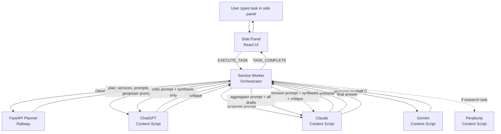

# MixerAI

**A Chrome extension that orchestrates ChatGPT, Claude, Gemini, and Perplexity as a Mixture-of-Agents pipeline — using the user's existing subscriptions instead of API keys.**

<!-- TODO: replace with hero screenshot of the side panel mid-orchestration -->

---

## Overview

Most consumer "multi-AI" tools fan a single prompt out to several models and show their answers side by side. That's a comparison, not a collaboration. MixerAI runs a real Mixture-of-Agents pipeline based on Wang et al.'s ICLR 2025 paper: three frontier models draft answers independently, a fourth synthesizes them, a fifth audits the synthesis without seeing the drafts (Chain-of-Verification independence, Dhuliawala et al. 2023), and a sixth revises against the audit. The user sees one final answer that is measurably tighter than any single constituent.

The architectural bet is that orchestration belongs in the browser, on top of the AI subscriptions a user already pays for, rather than behind another API gateway with another monthly bill. The extension drives logged-in sessions on `chatgpt.com`, `claude.ai`, `gemini.google.com`, and `perplexity.ai` directly — typing prompts into each service's input, capturing streamed responses, and routing them between models. The only server-side component is a small FastAPI planner that classifies the task, picks a strategy, and decides which models play which roles. Total per-task cost to the operator: about $0.08 on the Pro tier, $0.003 on Free.

Getting this to work end-to-end required solving a stack of MV3 service-worker lifecycle bugs, four-way DOM-capture races against frontend frameworks that change weekly, and the harder problem of how to actually force LLMs into adversarial postures instead of polite agreement.

---

## Key Features

- **Real Mixture-of-Agents orchestration.** Three independent proposers, an aggregator that synthesizes them, and an optional critic-revision pair on the Pro tier. Implements the independence principle from CoVe — the critic never sees the proposer drafts, which is what makes the audit a real audit rather than a stamp.

- **Bring-your-own-subscriptions.** Runs against the user's logged-in sessions on ChatGPT, Claude, Gemini, and Perplexity. No API keys for the user. No inference cost to the operator beyond the routing call.

- **Task-aware prompt routing.** A planner LLM classifies each task into one of eight buckets (code, math, writing, research, explanation, comparison, brainstorm, default) and selects a different proposer/aggregator prompt variant for each, with concrete per-task checklists.

- **MV3-hardened reliability.** Two-layer service-worker keepalive (chrome.alarms + setInterval), MutationObserver-driven polling to defeat Chrome's background-tab throttling, request-ID-keyed result cache on each content script for recovery from port disconnects mid-task.

- **Multilingual by design.** The proposer prompt's universal rules force language matching — Spanish task in, Spanish answer out — without requiring the user to specify it.

- **Four-service durability.** Each AI service has its own adapter with multi-strategy DOM selectors, finalization heuristics, and cleanup passes (KaTeX-token collapse for Claude math, artifact-duplication detection for long structured responses, etc.).

---

## Tech Stack

| Layer        | Technology                                                                                |
| ------------ | ----------------------------------------------------------------------------------------- |
| Extension    | TypeScript 5.5, React 18.3, Plasmo 0.90 (Manifest V3), Chrome extension APIs              |
| Side panel   | React + dark-themed CSS (no UI framework)                                                 |
| Adapters     | Per-service content scripts, MutationObserver, DOM polling, port-based messaging          |
| Planner      | Python 3.11, FastAPI, Anthropic SDK, Pydantic                                             |
| LLM routing  | Claude Haiku 4.5 (Free tier) / Claude Opus 4.7 (Pro tier)                                 |
| Hosting      | Railway (planner), GitHub (source)                                                        |
| Tooling      | Plasmo bundler, Prettier, TypeScript strict mode                                          |

---

## Architecture

The extension is split across three execution contexts: the side panel (React UI), a background service worker (orchestration), and four content scripts (one per AI service, injected into the host pages). They communicate over long-lived Chrome ports with a request-ID protocol for recovery.



A typical Pro-tier `moa_critic` run touches six AI calls and completes in 60–90 seconds. The planner call adds about 1–2 seconds on top.

---

## Getting Started

### Prerequisites

- Chrome or Chromium-based browser
- Node.js 18+
- Python 3.11+ (only for running the planner locally)
- Logged-in accounts on at least one of: ChatGPT, Claude, Gemini, Perplexity
- An Anthropic API key for the planner

### Install the extension

```bash
git clone https://github.com/ethanir/MixerAI.git
cd MixerAI
echo 'PLASMO_PUBLIC_PLANNER_URL=https://your-planner-url.example.com/plan' > .env
npm install
npm run build
```

Then load `build/chrome-mv3-prod/` as an unpacked extension at `chrome://extensions` with Developer Mode enabled.

### Run the planner

The deployed planner at Railway handles routing for production builds. To run it locally for development:

```bash
cd planner
python3 -m venv .venv
source .venv/bin/activate
pip install -r requirements.txt
echo 'ANTHROPIC_API_KEY=sk-ant-your-key-here' > .env
uvicorn server:app --reload --port 8000
```

Point `PLASMO_PUBLIC_PLANNER_URL` at `http://localhost:8000/plan` and rebuild.

---

## Environment Variables

| Variable                     | Where        | Required | Description                                          |
| ---------------------------- | ------------ | -------- | ---------------------------------------------------- |
| `PLASMO_PUBLIC_PLANNER_URL`  | Extension    | Yes      | Endpoint for the planner. Baked in at build time.    |
| `ANTHROPIC_API_KEY`          | Planner      | Yes      | Used for the routing LLM. Tier-gated to Haiku/Opus.  |
| `PLANNER_MODEL`              | Planner      | No       | Override the per-tier model selection (dev only).    |

---

## Usage

1. Open the side panel from the extension icon.
2. Sign into at least one of the four supported AI services in another tab. The panel detects which sessions are live.
3. Type a task. Click **Plan**.
4. The planner returns a strategy and the orchestrator drives the AI tabs in parallel.
5. Watch each service tick through *Running → Done* in the side panel. The synthesized answer streams back when the chain completes.

Pro tier additionally runs an independent critic against the synthesis and a revision pass on top — useful for hard reasoning, proofs, or technical writing where a second-pass audit catches what the first pass missed.

---

## Project Structure

```
MixerAI/
├── background.ts                # MV3 service worker: orchestration entry point + keepalive
├── sidepanel.tsx                # React side panel: task input, tier picker, status UI
├── style.css                    # Dark theme, teal accent
├── lib/
│   ├── orchestrator.ts          # Strategy dispatch, all five prompt builders, port protocol
│   ├── make-adapter.ts          # Shared polling loop, MutationObserver wakeup, recovery
│   ├── adapter-utils.ts         # Cross-adapter helpers (typing, stability detection)
│   ├── auth-detector.ts         # Per-tab session detection + result cache
│   └── types.ts                 # Shared message and plan schemas
├── contents/
│   ├── chatgpt.ts               # chatgpt.com adapter
│   ├── claude.ts                # claude.ai adapter (with KaTeX + artifact cleanup)
│   ├── gemini.ts                # gemini.google.com adapter
│   └── perplexity.ts            # perplexity.ai adapter
└── planner/
    ├── server.py                # FastAPI routing service
    ├── requirements.txt
    └── railway.toml             # Deployment config
```

---

## Notable Engineering Decisions

### Critic independence (Chain-of-Verification)

The critic model never sees the proposer drafts. It receives only the user's task and the synthesis, and audits the synthesis as if encountering it cold. This is the central insight from Dhuliawala et al.'s Chain-of-Verification paper: a verifier primed with the same context that produced an error will rationalize the error. The critic also runs on a different lab's model than the aggregator — Claude synthesizes, ChatGPT audits — so the audit doesn't inherit the synthesizer's blind spots.

### Three-context messaging with per-request IDs

The orchestrator runs in the service worker, the work runs in content scripts, and the user watches a side panel. Chrome's MV3 service workers are evicted after roughly 30 seconds of inactivity, which silently kills any port held by the worker. A naive port-only protocol drops results whenever an AI takes longer than that to respond — which is most of them. MixerAI assigns a monotonic request ID to every send, caches the result on `window.__mixerai.recentResults` in each content script before attempting port delivery, and on port disconnect falls back to a one-shot `chrome.tabs.sendMessage` to fetch the cached result from a fresh channel. Recovery works even after the SW dies and restarts.

### Two-layer service-worker keepalive

`chrome.alarms` with a 30-second period (Chrome's recommended MV3 pattern, persistent across SW restarts) plus a `setInterval` at 15 seconds (covers the first 30 seconds before the alarm system fires for the first time) plus a synchronous `chrome.runtime.getPlatformInfo()` call at task start to reset the idle timer before the first `await`. The combination keeps the SW alive through 90-second multi-stage tasks without relying on any single mechanism.

### Polling-loop hard gate

The shared adapter polling loop in `make-adapter.ts` evaluates four termination paths per iteration but enforces one hard gate: if the host site's stop button is still visible, no other signal can mark the response as done. This is what prevents Claude false-Done events during long thinking phases and matters for every model — each one has its own way of briefly clearing message content during UI re-mounts (action toolbars, artifact widgets) that would otherwise trip naive "text stopped growing" heuristics.

### MutationObserver-driven wakeup

Chrome throttles `setTimeout` in backgrounded tabs to roughly once per minute. A 500ms polling loop in a backgrounded Gemini tab effectively becomes 60-second polling, which is unusable. The adapter attaches a `MutationObserver` to `document.body` watching attribute changes on `aria-label`, `disabled`, `class`, and `data-state` — the four signals every host site uses to indicate response state — and aborts the current sleep on mutation, throttled to 100ms minimum. MutationObserver dispatch is not subject to the same throttling as setTimeout, so completion detection in a background tab drops from "up to 60 seconds late" to "within ~50ms of the actual DOM change."

---

## Challenges & Solutions

- **Challenge:** Service worker evictions silently dropping results from long-running AI responses. **Solution:** request-ID protocol with content-script-side result cache, plus the two-layer keepalive, plus a one-shot recovery path. Results survive SW restart, port disconnect, and half-closed channels.

- **Challenge:** Gemini's `rich-textarea` synthesizing an Enter keypress on the first `\n` of a multi-line prompt, sending only the first line. **Solution:** split prompts on newline and use `execCommand("insertLineBreak")` between lines instead of `insertText` with embedded newlines — inserts `<br>` without triggering Gemini's submit handler.

- **Challenge:** Claude's UI briefly re-mounts the assistant message element after streaming completes to attach the action toolbar and any artifact widgets. A naive "read text after polling exits" path catches the transient empty state and hangs in a 30-minute stability wait. **Solution:** trust the polling loop's captured length, gate the safety net on that value rather than re-reading, cap the safety wait at 15 seconds, and retry the final read once if it comes back empty after a successful capture.

- **Challenge:** Aggregator drift toward averaging the three drafts instead of selecting the strongest claims. **Solution:** explicit "do NOT average" framing in the aggregator prompt plus a forced "use drafts as evidence, re-derive from scratch, commit where they disagree" structure. Not a complete fix — proper validation needs an offline eval suite — but measurably reduces consensus-mush output.

- **Challenge:** DOM selectors on each host site decay as the host ships UI changes. **Solution:** multi-strategy fallback chains per adapter (e.g. `[data-test-render-count]` → `[role="article"]` → `.font-claude-message`), and post-capture cleanup passes (KaTeX char-per-line collapse, full-body artifact-duplication detection) that handle the inevitable raw-text quirks each service produces.

---

## Roadmap

- [x] MoA orchestration with three proposers and an aggregator
- [x] Critic + revision pipeline (Chain-of-Verification independence)
- [x] Four-service adapter coverage (ChatGPT, Claude, Gemini, Perplexity)
- [x] MV3 lifecycle hardening (keepalive, recovery, MutationObserver wakeup)
- [x] Task-aware prompt routing (8 task variants)
- [x] Tier system with code-gated Pro unlock
- [ ] Server-side tier enforcement with bearer tokens
- [ ] Anthropic 503/529 retry with exponential backoff + Opus→Sonnet fallback
- [ ] Offline eval suite for measuring MoA lift over single-model baselines
- [ ] File upload support (PDF, DOCX, CSV, image) with client-side extraction
- [ ] Network-layer response capture as fallback to DOM scraping
- [ ] Continuous chat / persistent project context across tasks

---

## License

Currently unlicensed. All rights reserved.

---

## Author

**Ethan Irimiciuc**
GitHub: [@ethanir](https://github.com/ethanir)
<!-- TODO: add LinkedIn, portfolio, email -->
